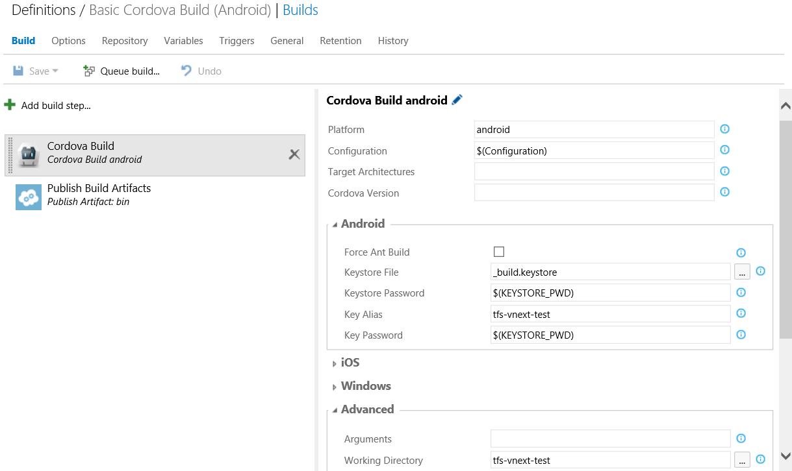
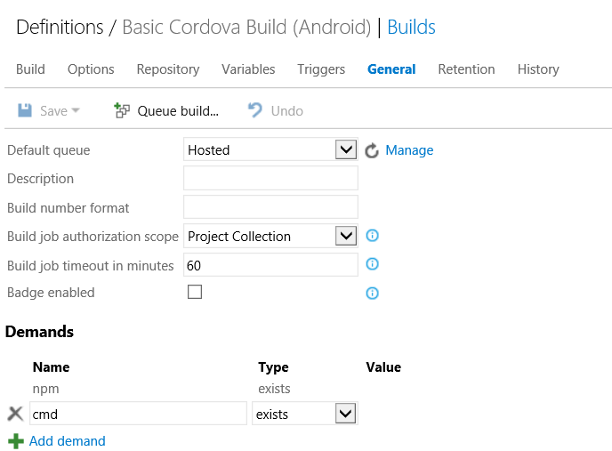
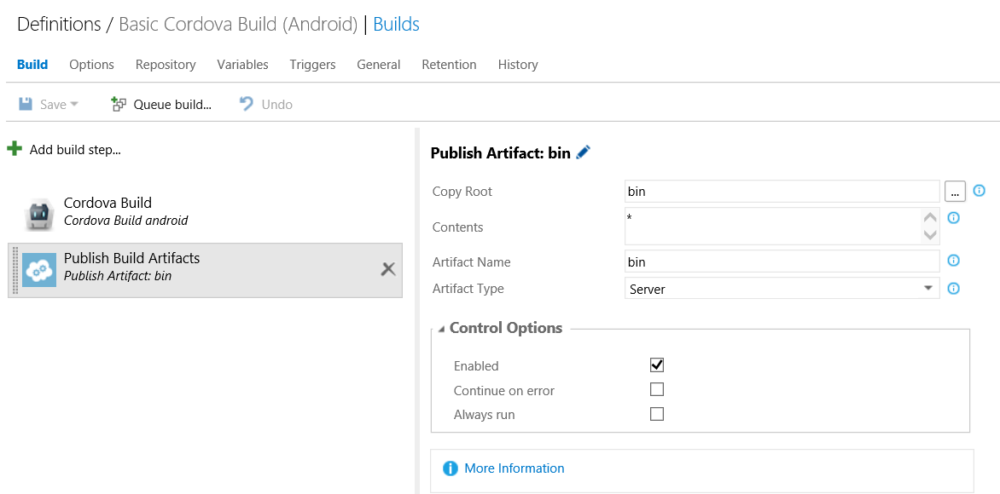
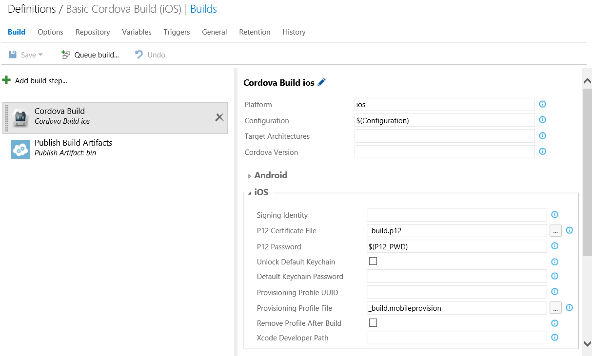
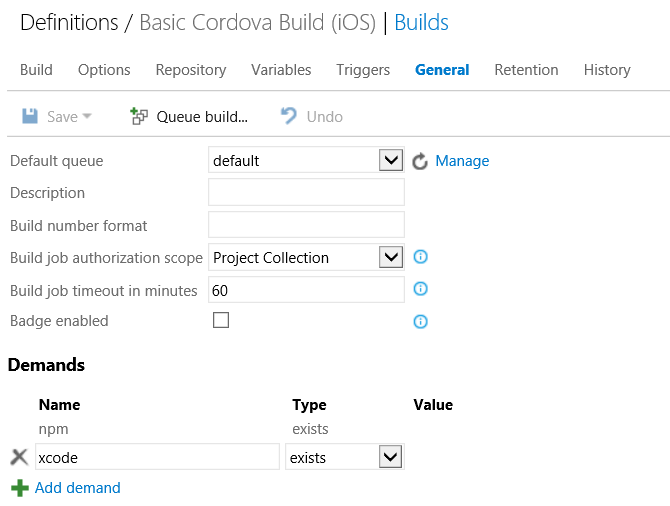
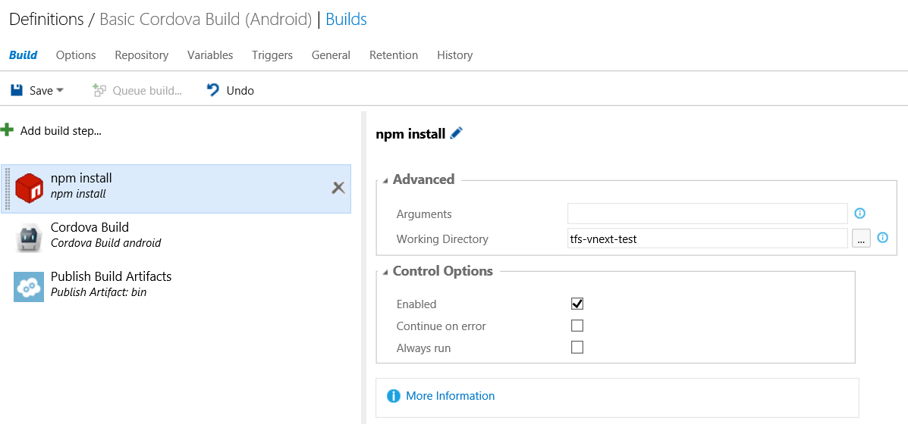
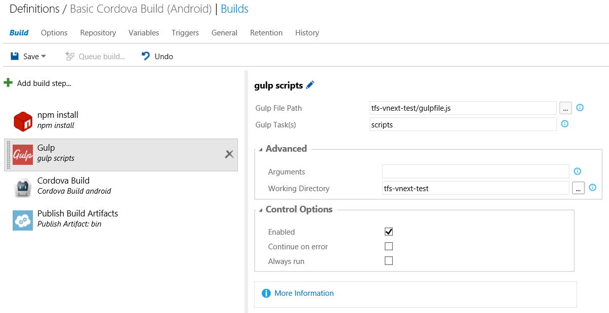
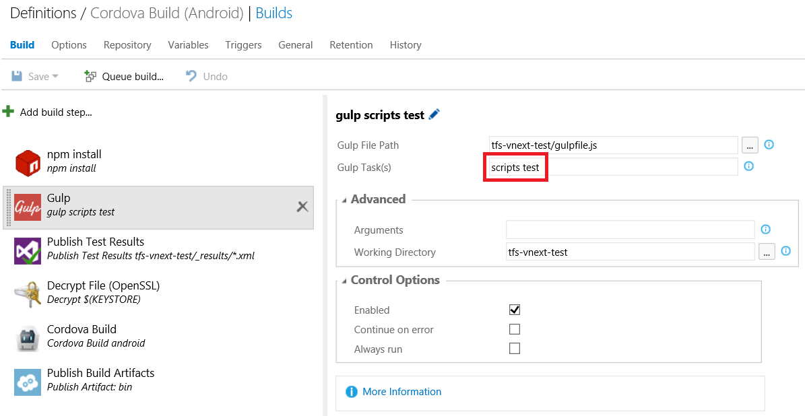
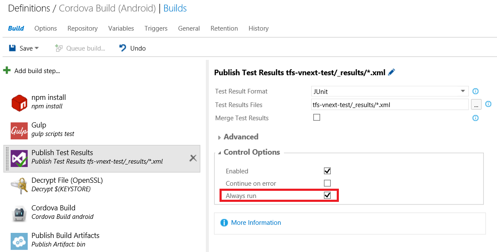

<properties pageTitle="Use the Visual Studio Tools for Apache Cordova with Visual Studio Online or Team Foundation Services 2015"
  description="Use the Visual Studio Tools for Apache Cordova with Visual Studio Online or Team Foundation Services 2015"
  services=""
  documentationCenter=""
  authors="bursteg, clantz" />

# Build Apache Cordova apps with Visual Studio Online or Team Foundation Services 2015
Visual Studio Online (VSO) and Team Foundation Services (TFS) 2015 can both be used for building and testing Cordova apps in a Continuous Integration (CI) environment thanks to a new [cross-platform agent](http://go.microsoft.com/fwlink/?LinkID=533789) that enables VSO or TFS to build directly on Windows or OSX. Further, [Tools for Apache Cordova](http://go.microsoft.com/fwlink/?LinkID=536496) is designed to work with a number of different CI systems since the projects it creates are standard [Apache Cordova Command Line interface](http://go.microsoft.com/fwlink/?LinkID=533773) (CLI) projects. The end result is you can use VSO or TFS to build projects created using Tools for Apache Cordova or any Cordova compliant CLI project like Ionic or the TACO CLI.

For this reason, this tutorial will focus on the use of the new next-generation build system rather than the XAML/MSBuild based build setup for Cordova apps. If you still need to use the legacy XAML / MSBuild based approach, see the [TFS 2013](./tfs2013.md) tutorial for details. The instructions generally still apply to TFS 2015.

>**Troubleshooting Tip**: Be aware that we recommend against adding the "platforms" folder or the following json files in the "plugins" folder into source control: android.json, ios.json, remote_ios.json, windows.json, and wp8.json. See "What to Add to Source Control" in the [general team build tutorial](http://go.microsoft.com/fwlink/?LinkID=691831) for additional details.

### Visual Studio Online Hosted Agents
As of this writing, you can build Cordova apps targeting Android, Windows, and Windows Phone using the Hosted Agent Pool in Visual Studio Online. This allows you to build without setting up a Windows build agent on premise. For iOS builds you can install the  [VSO cross-platform build agent](http://go.microsoft.com/fwlink/?LinkID=533789) on an OSX machine if you intend to build iOS. See [TFS 2015 documentation](http://go.microsoft.com/fwlink/?LinkID=533772) and either your own Mac or a cloud provider like [MacInCloud](http://go.microsoft.com/fwlink/?LinkID=533746). MacInCloud even provides a [special plan](http://go.microsoft.com/fwlink/?LinkID=691834) and streamlined setup experience for VSO agents!

All Cordova pre-requisites should already be installed and configured when using the Hosted Agent Pool in Visual Studio Online (VSO) or MacInCloud's special VSO plan. Cordova versions not already present will be dynamically downloaded during your build.

See [agent setup](#agentsetup) for details on setting up a build agent if you are either not using Visual Studio Online or want to use your own Mac to build for iOS.

## Project Setup & Build Definitions

### Installing the Cordova Build Task
To setup a Cordova build in Visual Studio Online or TFS 2015, you will need to install the Cordova Build task in your collection.

- **Visual Studio Online**: For Visual Studio Online, this is easy to do. Simply install the [Tools for Apache Cordova Extension](http://go.microsoft.com/fwlink/?LinkID=691835). 

- **TFS 2015 Update 1 and Earlier**: TFS 2015 Update 1 and below does not support installing VSO Extensions. Fortunately the installation of the Cordova task is still relatively easy to do by following these simple steps:
  1. Download the latest release of [vso-cordova-tasks](http://go.microsoft.com/fwlink/?LinkID=691191) and unzip it locally
  2. Navigate to the unzipped folder from the command prompt
  3. Simply type "upload" and follow the instructions that appear. You can also update the task following these same steps.

### Creating Your Build Definitions
We'll assume for the purposes of this tutorial that you want to build our Cordova app for Android, iOS, and Windows and you want to build everything on Windows except iOS. We will accomplish this by using the concept of a "demand" in two separate build definitions to route the work to the correct OS.

#### Building Android, Windows, or Windows Phone 8.0 on Windows
Detailed instructions on creating build definitions in TFS 2015 can be found in [its documentation](http://go.microsoft.com/fwlink/?LinkID=533772), but here are the specific settings you will need to use to configure a build.

1.  Create a new build definition by selecting the "Build" tab for your VSO/TFS project, clicking the "+" icon, and selecting "Empty" as the template. We'll start out targeting platforms that can be built on Windows so give the build definition a name that indicates that this is the case.

2.  Now we will add a Cordova Build task for Android 
	1.  Under the "Build" tab, add a new build step and select **Cordova Build** from the **Build** category
	2.  Use the following settings:
		- **Platform**: android
		- **Configuration**: debug or release. You can also use a variable from the Variables tab to allow you to select at build time.
		- **Cordova Version**: If you're using Tools for Apache Cordova you can leave this blank and the correct version will be used based on the contents of taco.json.
		- **Android**: Set these values if you want to sign a release build. See [securing your signing keys](./secure-certs.md) for details.
		- **Advanced &gt; Working Directory**: Location of the Cordova project itself inside your solution (not the solution root).

	

3.  Next we need to ensure that this particular build runs on Windows rather than OSX. Under the "General" tab, add a demand that "Cmd" exists.

	

6.  As an optional step, you can configure your build to upload the resulting build artifacts to your TFS or VSO instance for easy access. The sample gulpfile.js script places the resulting output in the "bin" folder to make configuration simple.

  1. Under the "Build" tab, add a new build step and select **Publish Artifact** from the **Build** category.
  2. Use the following settings:
		- **Copy Root**: Location specified in Advanced &gt; Output Directory in the Cordova Build step. Defaults to "bin."
		- **Contents:** *
		- **Artifact Name:** bin
		- **Artifact Type:** Server

	

Finally, click the "Queue build..." button to validate your setup. You'll see a real-time console view of your build progressing so you can quickly fine tune your definition.

That's it for Windows! You're now able to build Android. To build Windows or Windows Phone 8.0, follow these same steps and replace the "platform" value with "windows" or "wp8" respectively. 

##### Optional: Multi-Configuration Setup for Android, Windows, Windows Phone 8.0
If you intend to build more than just one platform on Windows you can use something called a "Multi-Configuration" setup to build for multiple platforms from a single build definition.

1. Go to the **Variables** tab and enter a variable called **Platform** with a value of "android, windows, wp8" or whichever platforms you want to build

2. Go to the **Options** tab, check **MultiConfiguration**, and set **Multipliers** to **Platform** 

3. Update your build definition as follows:
  1. Update the **Platform** value for the **Cordova Build** step to be **$(Platform)** and update platform specific options as appropriate.
  2. Update the **Publish Build Artifacts** task as follows:
    - **Contents**: $(Platform)/$(Configuration)/* - Or if you don't have a Configuration variable, place debug or release in that location as appropriate
    - **Artifact Name**: $(Platform)

Next time you build, it will queue up and build all three platforms and store separate artifacts for each using the platform name.

#### Definition for Building iOS on OSX
Now let's create a version of this same build definition to target iOS that will run on a configured cross-platform agent on OSX.

1. Right click on the Windows build definition and select "Clone." Once you save you should give this definition a name that indicates it's the iOS build. 

2. Change the "Platform" value for the "Cordova Build" step to "ios" 

3. Remove any values you placed under the "Android" category and instead populate the "iOS" category. See [securing your signing keys](./secure-certs.md) for details on the appropriate options to set for your situation. Be sure to check out the "P12 Certificate File" and "Provisioning Profile File" options that can really streamline setup!

	

4. Finally we need to add a demand that will route builds to OSX machines rather than Windows. Under the "General" tab, remove the "Cmd" demand and add a demand that "xcode" exists.

	

You are now all set! You can configure either of these build definitions further as you see fit including having them automatically fire off on check-in or adding other validations.

>**Troubleshooting Tip**: See ["Troubleshooting Tips for Building on OSX" in the general CI tutorial](http://go.microsoft.com/fwlink/?LinkID=691194) for tips on resolving common build errors that can occur when building Cordova projects on that operating system.

### Optional: Running Gulp Tasks
Using Gulp in a CI environment is fairly straight forward as you can see in the detailed [Gulp tutorial](http://go.microsoft.com/fwlink/?LinkID=533742). Cordova itself does not have built in TypeScript support, but Gulp can be configured easily to compile TypeScript, LESS, SASS, or anything else you may want. You can even use it to run your tests!

####TypeScript Example
To add TypeScript compilation into your build definition using Gulp, follow these steps:

1.  Take the sample files (gulpfile.js, package.json, karma.config.js) from the "samples/gulp" folder [from this GitHub repo](http://go.microsoft.com/fwlink/?LinkID=691189) and place them in the root of your project

2.  Check these files into source control with your project. From here you can modify gulpfile.js and add other gulp plugins. The [Gulp tutorial](http://go.microsoft.com/fwlink/?LinkID=533742) provides additional detail on what the gulpfile does and how to wire Gulp tasks as "hooks" into Cordova build events.

3.  Now we will configure the build definition to install any Gulp or npm package dependencies your build may have.
	1.  Under the "Build" tab, add a new build step and select **npm install** from the **Package** category
	2.  Use the following settings:
		- **Advanced &gt; Arguments:** --no-optional
		- **Advanced &gt; Working Directory**: Location of the Cordova project itself inside your solution (not the solution root).

	

4.  Next we'll configure Gulp itself.

  1.  Under the "Build" tab, add a new build step and select **Gulp** from the **Build** category.
	2.  Use the following settings:
		- **Gulp File Path**: Location gulpfile.js in your Cordova project (not the solution root).
		- **Gulp Task(s)**: The Gulp task you want to run. In this case, we'll run **scripts**
		- **Advanced &gt; Working Directory**: Location of the Cordova project itself inside your solution (not the solution root).

	

5.  Move these two tasks before your Cordova build step and you're all set! 

#### Using Gulp to Run Tests
You can also use the exact same Gulp build step above to run your tests! See the [Cordova test tutorials](http://go.microsoft.com/fwlink/?LinkID=691195) for details on setting up Gulp to run your tests but the scripts [from the GitHub repo](http://go.microsoft.com/fwlink/?LinkID=691189) mentioned above are ready for use with Jasmine, Karma, and PhantomJS. 

1. First, update the **Gulp Task(s)** option in the Gulp step above to reference your "test" task. A value of "scripts test" will first compile TypeScript (or anything else you have configured) and then run tests.

  

2. Next, we will configure the definition to publish your test results to VSO.

  1. Under the "Build" tab, add a new build step and select **Publish Test Results** from the **Test** category.
  2. Use the following settings:
    - **Test Result Format**: The Karma config in the sample is set up to output JUnit formatted results
    - **Test Results Files:** The Karma config in the sample is set up to drop results in an _results folder
    - **Advanced &gt; Always Run:** Be sure to heck this so your test results are published when the tests fail.

  

That's it!

##In Depth: Custom Build Agent Setup
If you are not using Visual Studio Online's (VSO) Hosted Agent Pool and are using your own locally hosted build agent, you'll need to install pre-requisites on your build server.

Since the build process we will describe here is not directly dependent on MSBuild or Visual Studio for Android, you have two options for installing pre-requisites on Windows:

1.  You can install Visual Studio 2015 and select the Tools for Apache Cordova option and let it install the pre-requisites for you

2.  Otherwise you can manually install only the pre-requisites needed for the specific platforms you intend to build. For example, you do not need to install Visual Studio at all if you only intend to target Android. See "Installing Dependencies" in the [Building Cordova Apps in a Team / Continuous Integration Environment](http://go.microsoft.com/fwlink/?LinkID=691196) tutorial for details.

Next you will need to install the Windows build agent to build Android, Windows, or Windows Phone, and the [VSO cross-platform build agent](http://go.microsoft.com/fwlink/?LinkID=533789) on an OSX machine if you intend to build iOS. See [TFS 2015 documentation](http://go.microsoft.com/fwlink/?LinkID=533772) for detailed instructions on configuring the agent for use with an on premise TFS 2015 instance or Visual Studio Online.  

Because of its design, you can also easily install the cross-platform agent an on-premise Mac or a cloud provider like [MacInCloud](http://go.microsoft.com/fwlink/?LinkID=533746) with Visual Studio Online. The OSX machine simply needs to have HTTP access to your VSO domain URI. MacInCloud even provides a [special plan](http://go.microsoft.com/fwlink/?LinkID=691834) and streamlined setup experience for VSO agents! 

You do not need a VPN connection and VSO does not need access to the OSX machine. Simply enter the your VSO project's domain URI when prompted during agent setup (Ex: "https://myvsodomain.visualstudio.com"). All other setup instructions apply directly.

>**Troubleshooting Tip:** See ["Internet Access & Proxy Setup" in the general CI tutorial](http://go.microsoft.com/fwlink/?LinkID=691832) if your build servers have limited Internet connectivity or require routing traffic through a proxy.

###Environment Variables
Note: All Cordova pre-requisites should already be installed and configured when using the Hosted Agent Pool in Visual Studio Online (VSO) or agents from MacInCloud's special VSO agent plan. Cordova versions not already present will be dynamically downloaded during your build. You can skip this section if you are only using the VSO Hosted Agent Pool.

You should set the following environment variables if they have not already been configured on each server you have configured a build agent.

<table>
	<thead>
		<tr>
			<td><strong>Variable</strong></td>
			<td><strong>Required For</strong></td>
			<td><strong>Purpose</strong></td>
			<td><strong>Default Location (Visual Studio 2015)</strong></td>
		</tr>
	</thead>
	<tbody>
    <tr>
      <td><strong>ANDROID_HOME</strong></td>
      <td>Android</td>
      <td>Location of the Android SDK</td>
      <td>C:\Program Files (x86)\Android\android-sdk</td>
    </tr>
    <tr>
      <td><strong>JAVA_HOME</strong></td>
      <td>Android</td>
      <td>Location of Java</td>
      <td>C:\Program Files (x86)\Java\jdk1.7.0\_55</td>
    </tr>
    <tr>
      <td><strong>ANT_HOME</strong></td>
      <td>Android when building using Ant (not Gradle)</td>
      <td>Location of Ant</td>
      <td>C:\Program Files (x86)\Microsoft Visual Studio 14.0\Apps\apache-ant-1.9.3</td>
    </tr>
    <tr>
      <td><strong>GRADLE_USER_HOME</strong></td>
      <td>Optional</td>
      <td>Overrides the default location Gradle build system dependencies should be installed when building Android using Cordova 5.0.0+</td>
      <td>If not specified, uses %USERPROFILE%\.gradle on Windows or ~/.gradle on OSX or Linux</td>
    </tr>
    <tr>
      <td><strong>CORDOVA_CACHE</strong></td>
      <td>Optional</td>
      <td>Overrides the default location used by the Cordova Build Task to cache installs of multiple versions of Cordova.</td>
      <td>If not specified, uses %APPDATA%\cordova-cache on Windows and ~/.cordova-cache on OSX or Linux</td>
    </tr>
  </tbody>
</table>

#### Setting Your Path
The following will also need to be in your path:
- **Node.js** should already be in your path on OSX/Linux simply by the fact that you've setup the cross-platform build agent. However, on Windows you should ensure **both** Node.js and the global modules folder (aka "prefix" location) is in your path as there a circumstances where one or the other may be missing. The default location of Node.js on Windows is **%PROGRAMFILES(x86)%\\nodejs** while the default location where global node modules are installed is **%APPDATA%\\npm**.

>**Troubleshooting Tip**: *Be sure to use a version of Node.js < 4.0.0 on OSX if you are using Cordova < 5.3.3.* One of Cordova's iOS related dependencies has compatibility issues with Node.js 4.0.0 which were resolved in 5.3.3.

- **Gulp** should also be installed globally if you intend to use the Gulp task to avoid path-too-long errors on Windows. Once Node.js is installed, simply type **npm install -g gulp** from the command line.
- **%ANT_HOME%\bin** (or $ANT_HOME\bin on OSX/Linux) should be added to your path if you are using a version of Cordova < 5.0.0 or have specified the "--ant" build option.

## More Information
* [Learn about securing your signing keys](./secure-certs.md)
* [Learn about Tools for Apache Cordova](http://go.microsoft.com/fwlink/?LinkID=618473)
* [Read tutorials and learn about tips, tricks, and known issues for Cordova](http://go.microsoft.com/fwlink/?LinkID=618471)
* [Download samples from our Cordova Samples repository](http://github.com/Microsoft/cordova-samples)
* [Follow us on Twitter](https://twitter.com/VSCordovaTools)
* [Visit our site http://aka.ms/cordova](http://aka.ms/cordova)
* [Ask for help on StackOverflow](http://stackoverflow.com/questions/tagged/visual-studio-cordova)
