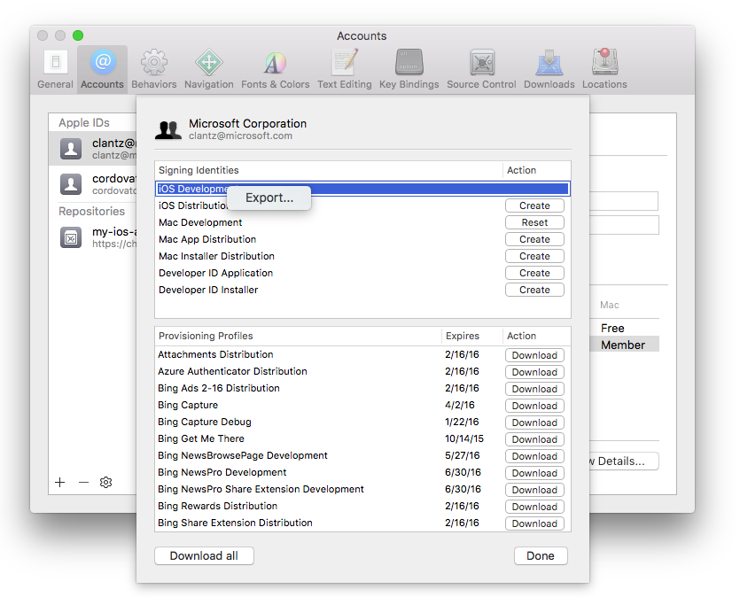
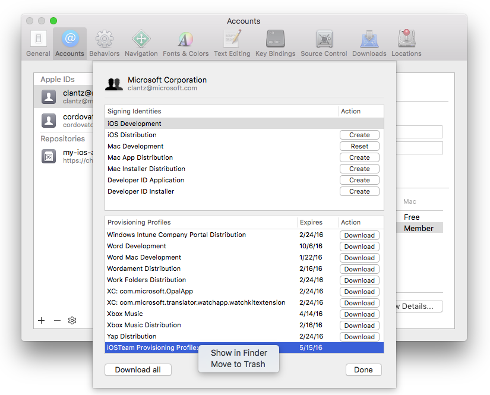
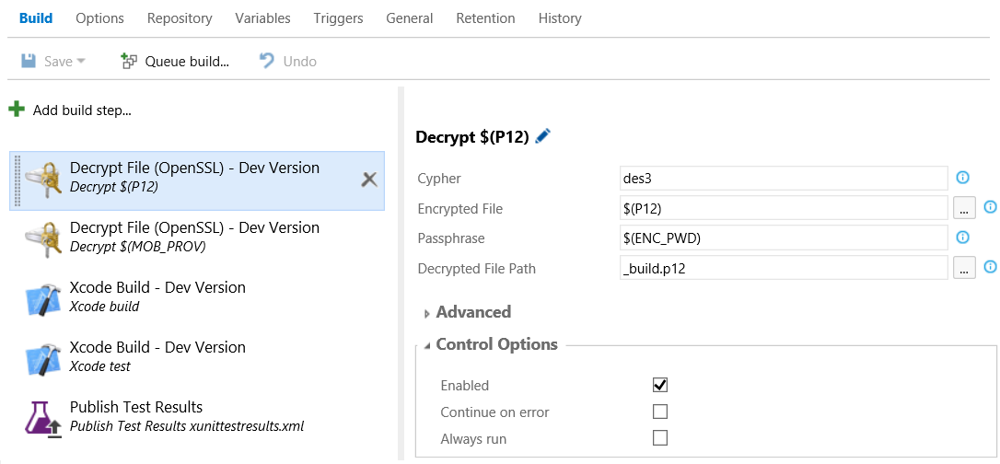
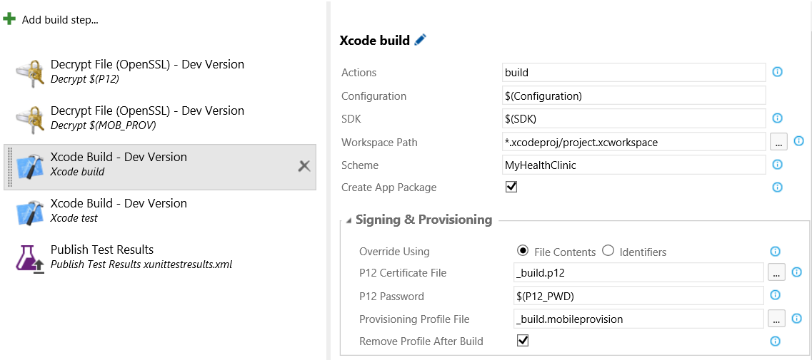

<properties pageTitle="Simple, Secure CI App Signing Using Visual Studio Online or Team Foundation Services 2015"
  description="Simple, Secure CI App Signing Using Visual Studio Online or Team Foundation Services 2015"
  services=""
  documentationCenter=""
  authors="clantz" />

# Simple, Secure CI App Signing Using Visual Studio Online or Team Foundation Services 2015
When developing an app for iOS or Android either natively or using a cross-platform solution like Cordova you will eventually need to tackle the problem of managing signing certificates and (in the case of iOS) [Mobile Provisioning Profiles](https://developer.apple.com/library/ios/documentation/IDEs/Conceptual/AppStoreDistributionTutorial/Introduction/Introduction.html#//apple_ref/doc/uid/TP40013839). This article will highlight some features to help you manage and secure them for your app.

This article currently covers:

- [iOS native and Cordova iOS Projects](#ios)
- [Android native and Cordova Android Projects](#android)

## iOS on OSX
### Summary of Challenges with Default iOS Project Behaviors in a CI Environment
For iOS there are a number of challenges associated with managing certificates and profiles particularly in a CI environment.

1. Generated signing certificates are *local to the machine you created them on*. Certificates generated via Xcode or via the Apple Developer portal are tied to a private key that is local to your machine.
2. There are limited number of certificates that can exist for a given type. If you have three machines that need to be able to sign your app, you ultimately need to use the exact same cert on each machine.
3. By default, Xcode uses an auto-match procedure to find both an appropriate signing certificate and provisioning profile. This can be quite problematic in a CI environment where you likely want to use a very specific signing certificate and provisioning profile.
4. "Ad hoc" provisioning profiles typically used for beta distribution tie to the same "iPhone Distribution" certificate used for actual app store distribution. As a result, auto-matching using a "signing identity" does not work well when you need the same machine to generate an ipa of both types.
5. While you can reference a specific provisioning profile in Xcode itself, specifying the exact provisioning profile requires referencing a UUID contained within the file that is difficult to access. This limits your ability to have your CI configuration independent of the contents of your project.
6. There is no offical command to install a provisioning profile from the command line
7. The "default keychain" is typically locked when a process is not running interactively. As a result, if you VSO agent is running as a daemon or launch agent you will be unable to use signing certificates installed on your machine. You can add a "Command Line" build step calling the appropriate "security" command to unlock the keychain but this requires you to specify the password in your build definition and prevents you from having different passwords on different servers.
8. Installing certificates in the default keychain makes them available to anyone with access to create build definitions by executing a "security" command after unlocking the keychain
9. A commonly used trick to generate versions multiple signed versions of your app in the past has been to leverage the "PackageApplicaiton" script and pass in signing and provisioning profile embedding arguments. However, this script fails as of Xcode 6 (and still fails in 7.1 beta) unless you add something called a ResourceRule to your project. The issue is that this concept is deprecated and Apple has stated they will reject apps that use it that are published to the store.

Combined, this results in a bit of a nightmare. 

### Simplifying and Securing the Build Environment for iOS
To help alleviate these problems, the Xcode Build and Cordova Build tasks include some additional features designed to streamline this process. 

#### Using a Certificate and Mobile Provisioning File in Your Build

1. After creating your development and/or distribution signing certificate, export it to a .p12 file using either Keychain Access or Xcode
  
  1. To export using Xcode, first go to Xcode > Preferences... > Accounts and select your Apple Developer account
  
  2. Click "View Details..." and then right click on the Signing Identity you wish to export, and click "Export..."
  
  3. Enter a filename and password. Take note of the password as we will need this later. 
  
	

  Alternatively you can follow a similar process using the "Keychain Access" app on OSX or even generate a signing certificate on Windows. Use the procedure [described in this article](http://docs.build.phonegap.com/en_US/signing_signing-ios.md.html#_windows_users) if you would prefer to head this direction instead.

2. Next, get a copy of the provisioning profile you want to use.
  
  1. You can simply go to the Apple Developer portal and download your mobile provisioning profile from there but you can also use Xcode to access one installed on your machine.
  
  2. First go to the same screen you used to get the .p12 file above 
  
  3. Next, right click the provisioning profile you want and select "Show in Finder"
  
  4. Copy the file highlighted to another location and it a descriptive filename 

	

3. At this point you can opt to add these two files directly to source control or add an extra layer of security by encrypting them first. **See the next section for details on this step.**

4. Next, go to VSO / TFS and open up your Xcode or Cordova build definition and go to the **Variables** tab. Here we will enter password for the .p12 file:

    - **P12_PWD**: Password to the unencrypted .p12 file. *Be sure to click the "lock" icon.* This will secure your password and obscure it in all logs.

	

5. Finally, we'll update our Xcode Build or Cordova Build step with references to these two files. The build step will automatically determine the correct "signing identity" based on the contents of the .p12, create a temporary keychain with the .p12 in it and use that exclusively for this build, install the mobile provisioning profile, determine the correct UUID based on the contents of the .mobileprovision profile, and then clean everything up afterwards. 
  
    Enter the following values under the **Signing & Provisioning** category for the Xcode Build task or the **iOS** category in the Cordova Build task:
  
    - **Override Using**: File Contents
    - **P12 Certificate File**: Path to the .p12 file in the repository
    - **P12 Password**: $(P12_PWD)
    - **Provisioning Profile File**: Path to the .mobileprovision file in the repository
    - **Remove Profile After Build**: Checked if you want the mobileprovision profile to be removed from the system after the build. Only check this if you will have one agent on the system running this build as it is installed in a global location.

	
  
You are now all set! Any build agent that is running will now be able to build your app without any cert management on the build machine itself!!  Simply repeat the process of adding different certificates and provisioning profiles to your source repo to enable separate dev, beta (ad hoc), and distribution build. 

In the next section we'll cover how to add another layer of security by encrypting these files.
  
#### Optional: Using an Encrypted .p12 and .mobileprovision File
You can add an extra layer of security by to your project by encrypting your .p12 and .mobileprovision files so that only those that have been given the appropriate credentials have permissions to use them. The "Decrypt File" task makes this easy to setup in your build task.

1. First, encrypt your files.

  1. Open the Terminal app on your Mac
  
  2. Change to the folder containing your .p12 file and .mobileprovision file.
  
  3. Type the following:
  
    ~~~~~~~~~~~~~~~~~~~~~~~~~~~~~~~~
    openssl des3 -in iphonedeveloper.p12 -out iphonedeveloper.p12.enc
    ~~~~~~~~~~~~~~~~~~~~~~~~~~~~~~~~
    
    ...substituting des3 for any encryption cypher you'd like to use and the appropriate input and output file names.
  
  4. Enter a passphrase to encrypt the certificate when prompted and note this down as we will use it later.
  
2. Next, add these two files to source control (the encrypted .p12 and .mobileprovision files). This is secure particularly if you are using a private repository since a malicious user would need access to the repository, the encryption passphrase, and the P12 passphrase to be able to use your information without permission. Remove any unencrypted copies if present.

3. Now we'll set up our build definition to decrypt the files at build time.

  1. Open up your Xcode or Cordova build definition and go to the **Variables** tab and enter the following:
  
    - **P12**: Path to your encrypted .p12 file in source control.
    - **P12_PWD**: Password to the unencrypted .p12 file. *Be sure to click the "lock" icon.* This will secure your password and obscure it in all logs.
    - **MOB_PROV**: Path to your encrypted mobile provisioning profile.
    - **ENC_PWD**: The passphrase you used to encrypt the .p12 and .mobileprovision files. If you used two different passphrase you'll need two variables.  Again, *be sure to click the "lock" icon.*

	
  
  2. Under the **Build** tab in your build definition, add two **Decrypt File (OpenSSL)** steps from the **Utility** category and move these to the top of your build definition.
  
  3. Now, enter the proper information using the variables we created above to decrypt the two files to a static filename.
  
    - **Cypher**: The cypher you specified while encrypting. (Ex: des3)
    - **Encrypted File**: $(P12) for one step and $(MOB_PROV) for the other
    - **Passphrase**: $(ENC_PWD)
    - **Decrypted File Path**: _build.p12 for one step and _build.mobileprovision for the other

	
 
4. Finally, we'll just update the Xcode Build step we setup before to reference the decrypted files.
    
    - **Override Using**: File Contents
    - **P12 Certificate File**: _build.p12
    - **P12 Password**: $(P12_PWD)
    - **Provisioning Profile File**: _build.mobileprovision
    - **Remove Profile After Build**: Checked if you want the mobileprovision profile to be removed from the system after the build. Only check this if you will have one agent on the system running this build as it is installed in a global location.

	
  
 You are now all set! Any build agent that is running will now be able to securely build your app without any cert management on the build machine itself!!  Simply repeat the process of adding different certificates and provisioning profiles to your source repo to enable separate dev, beta (ad hoc), and distribution build.

## Android on Windows or OSX
Unlike iOS, managing Android signing is comparatively simple. For native builds using Ant or Gradle, the [Android documentation](http://developer.android.com/tools/publishing/app-signing.html) on the topic largely covers what you need to know to generate and use a keystore file containing your signing cert. 

However, here are a few additional tips that can help you get your app up and running quickly while still keeping your signing key secure. Just as with iOS, you can take your security one step farther by encrypting your keystore before placing it in a source code repository for use. 

Follow these steps:

1. **Windows only**: You may need to install openssl.exe. If you have the [Git command line tools](http://www.git-scm.com/downloads) installed, openssl may already be in your path (Ex: C:\Program Files (x86)\Git\bin). If not, install the command line tools or download a binary distribution of OpenSSL for Windows from [one of the community mirrors](http://go.microsoft.com/fwlink/?LinkID=627128) and it to your path. This will also need to be done on any Windows machines running a build agent.

2. Now we'll encrypt the keystore for your app.

  1. Open the Terminal app on Mac or a command prompt on Windows and go to where your keystore is located.

  2. Type the following:

    ~~~~~~~~~~~~~~~~~~~~~~~~~~~~~~~~
    openssl des3 -in release.keystore -out release.keystore.enc
    ~~~~~~~~~~~~~~~~~~~~~~~~~~~~~~~~
  
    ...substituting des3 for any encryption cypher you'd like to use and the appropriate input and output file names.
  
  3. Enter a passphrase to encrypt the certificate when prompted and note this down as we will use it later.

3. Next, add the encrypted keystore to source control. This is secure particularly if you are using a private repository since a malicious user would need access to the repository, the encryption passphrase, the keystore password, and the alias password to be able to use your information without permission.

4. Finally we'll update your build definition to decrypt and use the keystore. 

  1. Open up your Android or Cordova build definition and go to the **Variables** tab. Here we will enter the following:
  
    - **KEYSTORE**: Path to your encrypted keystore file in source control. 
    - **KEYSTORE_PWD**: Password to the unencrypted keystore file. *Be sure to click the "lock" icon.* This will secure your password and obscure it in all logs.
    - **KEY**: The key alias for the signing certificate you generated.
    - **KEY_PWD**: The password for the key associated with the specified alias. *Again, Be sure to click the "lock" icon.* 
    - **ENC_PWD**: The passphrase you used to encrypt the keystore file. *Be sure to click the "lock" icon.*    

    
  
  2. Under the **Build** tab in your build definition, add a **Decrypt File (OpenSSL)** steps from the **Utility** category and move this to the top of your build definition.
  
  4. Now, enter the proper information using the variables we created above to decrypt the two files to a static filename.
  
    - **Cypher**: The cypher you specified while encrypting. (Ex: des3)
    - **Encrypted File**: $(KEYSTORE)
    - **Passphrase**: $(ENC_PWD)
    - **Decrypted File Path**: _build.keystore

    
    
  5. Finally, updating the actual build step to use these values you entered is simple regardless of your build system.
    
    1. If you are using the **Gradle, Ant, or Maven** build tasks, you can add the following under **Options**: 
   
      ~~~~~~~~~~~~~~~~~~~~~~~~~~
      -Pkey.store=_build.keystore -Pkey.store.password=$(KEYSTORE_PWD) -Pkey.alias=$(KEY) -Pkey.alias.password=$(KEY_PWD)
      ~~~~~~~~~~~~~~~~~~~~~~~~~~

      

    2. If you are using the **Cordova Build** or **Android Signing** tasks, you can add the following under **Android** or **Jarsign Options** respectively:
         
      - **Keystore File**: _build.keystore
      - **Keystore Password**: $(KEYSTORE_PWD)
      - **Key Alias**: $(KEY)
      - **KEY Password**:$(KEY_PWD)

      

You are now all set! Any build agent that is running will now be able to securely build your app without any cert management on the build machine itself!!  
   